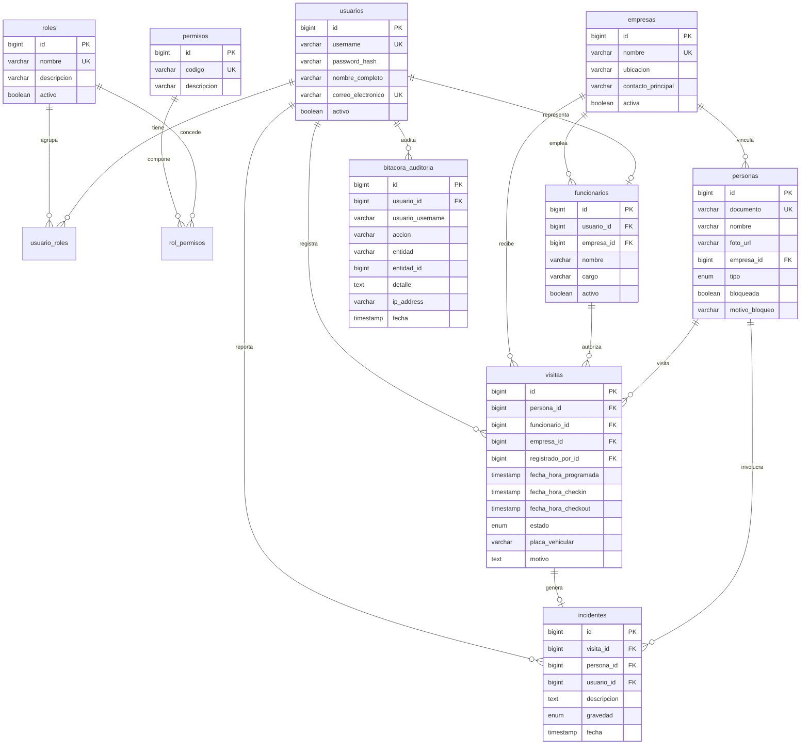

# SICA

## Sistema Integrado de Control de Acceso

SICA es una aplicación de escritorio para administrar el acceso físico a un complejo empresarial como **Zona Acme**. Reemplaza los registros manuales por un flujo controlado para registrar personas, empresas, funcionarios, visitantes, ingresos, salidas, incidentes y auditoría.

El sistema está construido con Java, JavaFX, JDBC y MySQL, sin Spring Boot ni frameworks de aplicación. La versión de demostración incluye datos semilla para probar los flujos principales desde el primer arranque.

## Problemas que resuelve

- Controlar quién puede ingresar a las instalaciones.
- Centralizar la información de empresas, funcionarios, trabajadores, invitados y usuarios.
- Evitar ingresos sin autorización mediante estados y permisos.
- Gestionar el ciclo completo de una visita: pre-registro, aprobación, ingreso y salida.
- Registrar visitantes no anunciados.
- Controlar personas bloqueadas o con prohibición de ingreso.
- Registrar y consultar incidentes relacionados con visitas.
- Mantener una bitácora de quién hizo cada operación y cuándo.
- Generar reportes de accesos e incidentes con filtros.
- Reducir errores de digitación y pérdida de información de los registros en papel.

## Funcionalidades

### Autenticación y seguridad

- Inicio de sesión con usuario y contraseña.
- Contraseñas almacenadas mediante `PBKDF2WithHmacSHA256`.
- Control de acceso basado en roles y permisos.
- Cadena de autorización con sesión activa y validación de permiso.
- Sesión con tiempo de expiración de 30 minutos.
- Registro de inicios de sesión y cierre de sesión en la bitácora.
- Limitación de frecuencia para reducir intentos abusivos.

### Gestión administrativa

- Crear, consultar y editar empresas.
- Crear, consultar y editar funcionarios asociados a empresas.
- Crear, consultar y editar personas.
- Crear, consultar y editar usuarios.
- Crear y editar roles.
- Crear y editar permisos.
- Asignar permisos a roles.
- Asignar roles a usuarios.

### Control de visitas

- Pre-registrar invitados.
- Aprobar o rechazar visitas pendientes.
- Registrar visitantes no anunciados.
- Registrar trabajadores.
- Confirmar check-in.
- Confirmar check-out.
- Regularizar salidas olvidadas.
- Consultar personas bloqueadas y bloquear o desbloquear personas.

### Incidentes, auditoría y reportes

- Registrar incidentes con descripción y gravedad.
- Asociar un incidente con una persona, visita y usuario responsable.
- Consultar la bitácora de auditoría.
- Consultar reporte de accesos por rango de fechas y empresa.
- Consultar reporte de incidentes por rango de fechas, empresa y gravedad.
- Visualizar actividad reciente desde el dashboard.

## Roles de demostración

| Usuario | Contraseña | Rol | Uso principal |
|---|---|---|---|
| `admin` | `admin123` | Administrador | Configuración y administración completa |
| `guarda1` | `guarda123` | Guarda de Seguridad | Operación de ingresos, salidas e incidentes |
| `funcionario1` | `funcionario123` | Funcionario Empresa | Pre-registro y gestión de visitas |

Los permisos efectivos dependen de los roles asignados en la base de datos. Estas credenciales son únicamente para desarrollo y demostración.

## Requisitos

- JDK 17 o superior.
- Maven 3.8 o superior.
- MySQL 8 o superior.
- Sistema operativo con soporte para JavaFX.
- Puerto MySQL `3307` disponible.

La aplicación fue configurada para compilar con Java 17. El driver utilizado es MySQL Connector/J 8.0.33 y también puede conectarse a instalaciones compatibles de MySQL más recientes.

## Instalación y configuración

### 1. Crear o verificar la base de datos

No es necesario crear manualmente las tablas. Al iniciar la aplicación, `InicializadorBaseDatos` ejecuta:

- `src/main/resources/schema.sql`
- `src/main/resources/data.sql`

El esquema crea la base de datos `campus`, sus tablas, índices y datos semilla de forma idempotente.

### 2. Configurar la conexión

La configuración está en `src/main/resources/application.properties`:

```properties
db.url=jdbc:mysql://localhost:3307/campus?createDatabaseIfNotExist=true&useSSL=true&allowPublicKeyRetrieval=true&serverTimezone=America/Guayaquil
db.username=campus
db.password=campus123
db.driver=com.mysql.cj.jdbc.Driver
```

La contraseña se puede proporcionar mediante la variable de entorno `DB_PASSWORD`. Si no se proporciona, se utiliza el valor por defecto incluido para desarrollo local.

En un entorno real se recomienda definir la variable de entorno y cambiar las credenciales por defecto.

### 3. Descargar dependencias y compilar

Desde la raíz del proyecto:

```bash
mvn clean package
```

El resultado esperado es:

```text
Tests run: 139, Failures: 0, Errors: 0, Skipped: 0
BUILD SUCCESS
```

## Ejecución

### Con Maven

```bash
mvn javafx:run
```

### Con el JAR ejecutable

Después de `mvn clean package`:

```bash
java -jar target/sica-1.0.0-SNAPSHOT.jar
```

El JAR es un artefacto completo generado por Maven Shade e incluye las dependencias necesarias para ejecutarse.

## Guía de uso botón por botón

### 1. Iniciar sesión

1. Ejecutar la aplicación.
2. Escribir un usuario de prueba.
3. Escribir su contraseña.
4. Pulsar **Ingresar**.
5. Verificar que se abra el dashboard en pantalla completa.

### 2. Dashboard

El dashboard muestra las métricas del sistema, la actividad reciente y el panel de módulos.

#### Seguridad y Acceso

- **Roles**: crear roles, consultar roles existentes y editar su información.
- **Permisos**: crear o consultar permisos disponibles para el sistema.
- **Asignar roles**: seleccionar un usuario y asignarle los roles activos.
- **Usuarios**: registrar, consultar y editar usuarios, incluyendo nombre, correo, contraseña y estado.

#### Organización

- **Empresas**: registrar y administrar empresas, ubicación y contacto principal.
- **Funcionarios**: registrar funcionarios vinculados a una empresa y, cuando corresponda, a un usuario.
- **Personas**: registrar invitados o trabajadores, documento, empresa y datos de identificación.

#### Operaciones de Acceso

- **Pre-registrar**: seleccionar o registrar la persona, indicar funcionario responsable, motivo, fecha y datos de la visita.
- **Check-in**: consultar visitas aprobadas pendientes de ingreso y confirmar la entrada.
- **No anunciado**: registrar una persona que llegó sin pre-registro; la lista se actualiza mediante consulta periódica.
- **Aprobar / rechazar**: consultar visitas pendientes y aprobarlas o rechazarlas.
- **Trabajador**: registrar el acceso de un trabajador como visita operativa.
- **Salida olvidada**: regularizar una visita que no registró su check-out mediante la estrategia correspondiente.
- **Check-out**: seleccionar una persona dentro del recinto y confirmar su salida.

#### Seguridad

- **Incidentes**: registrar descripción, gravedad, persona afectada y visita relacionada.
- **Bloqueos**: consultar personas bloqueadas y bloquear o desbloquear el acceso de una persona.

#### Reportes

- **Accesos**: seleccionar fechas y, opcionalmente, empresa. Pulsar **Buscar** para consultar persona, tipo, ingreso, salida y estado.
- **Incidentes**: seleccionar fechas, empresa y gravedad. Pulsar **Buscar** para consultar fecha, persona, gravedad, descripción y usuario responsable.
- **Bitácora**: filtrar y revisar las acciones registradas por el sistema.

### 3. Volver y cerrar sesión

- **Volver** regresa al dashboard sin cerrar la sesión.
- **Cerrar Sesión** solicita confirmación, invalida la sesión y devuelve al login.
- La navegación cambia el contenido de la escena existente para evitar transiciones de ventana y conservar pantalla completa.

## Flujos recomendados para probar

### Flujo de invitado autorizado

1. Iniciar sesión como `funcionario1`.
2. Abrir **Personas** y registrar un invitado si no existe.
3. Abrir **Pre-registrar** y crear la visita.
4. Iniciar sesión como usuario con permiso de aprobación.
5. Abrir **Aprobar / rechazar** y aprobar la visita.
6. Abrir **Check-in** y confirmar el ingreso.
7. Abrir **Check-out** y confirmar la salida.
8. Abrir **Reporte de Accesos** y verificar el registro.

### Flujo de visitante no anunciado

1. Iniciar sesión como `guarda1`.
2. Abrir **No anunciado**.
3. Registrar la persona y el motivo de la visita.
4. Verificar que aparezca en la lista de visitas pendientes.
5. Aprobar o rechazar desde el módulo correspondiente.
6. Completar check-in y check-out si la visita fue aprobada.

### Flujo de bloqueo

1. Abrir **Personas** y verificar una persona registrada.
2. Abrir **Bloqueos**.
3. Seleccionar la persona y bloquearla.
4. Intentar registrar una visita para esa persona.
5. Verificar que el sistema impida el acceso.
6. Desbloquear la persona y repetir el flujo.

### Flujo de auditoría

1. Iniciar sesión.
2. Crear o editar una entidad, por ejemplo una empresa o un rol.
3. Registrar una visita o incidente.
4. Abrir **Bitácora**.
5. Verificar usuario, acción, entidad, detalle y fecha.

## Base de datos

El esquema contiene 13 tablas principales.

### Diagrama Entidad-Relación



Los catálogos `persona_estados_acceso` y `visita_estados` mantienen los valores válidos de estado para personas y visitas.

### Agrupación de tablas

### Seguridad y RBAC

- `roles`
- `permisos`
- `rol_permisos`
- `usuarios`
- `usuario_roles`

### Catálogos

- `persona_estados_acceso`
- `visita_estados`

### Operación

- `empresas`
- `funcionarios`
- `personas`
- `visitas`
- `incidentes`
- `bitacora_auditoria`

El esquema incluye claves foráneas, restricciones `UNIQUE`, índices para consultas frecuentes y estados controlados para visitas e incidentes.

## Arquitectura

El proyecto utiliza una combinación de **Arquitectura Hexagonal** y organización por funcionalidades verticales.

```text
src/
├── main/
│   ├── java/com/acme/sica/
│   │   ├── Main.java
│   │   ├── dominio/
│   │   │   ├── modelo/              Entidades del dominio
│   │   │   ├── excepciones/         Reglas y errores de negocio
│   │   │   └── puerto/
│   │   │       ├── entrada/         Casos de uso
│   │   │       └── salida/          Interfaces de persistencia
│   │   ├── aplicacion/
│   │   │   ├── autenticacion/       Login y sesión
│   │   │   ├── auditoria/           Registro transversal
│   │   │   ├── bitacora/            Consultas de auditoría
│   │   │   ├── empresa/
│   │   │   ├── funcionario/
│   │   │   ├── incidente/
│   │   │   ├── permiso/
│   │   │   ├── persona/
│   │   │   ├── rol/
│   │   │   ├── usuario/
│   │   │   └── visita/              Flujos de acceso
│   │   └── infraestructura/
│   │       ├── configuracion/       DI manual y configuración
│   │       ├── persistencia/jdbc/   Repositorios MySQL
│   │       ├── seguridad/           Hash y autorización
│   │       └── ui/javafx/           Controladores y navegación
│   └── resources/
│       ├── application.properties
│       ├── css/application.css
│       ├── fxml/                    Vistas JavaFX
│       ├── messages.properties
│       ├── schema.sql
│       └── data.sql
└── test/java/                       Pruebas unitarias
```

### Flujo de una operación

```text
FXML / controlador JavaFX
        ↓
Caso de uso de aplicación
        ↓
Autorización y reglas de negocio
        ↓
Puerto de salida
        ↓
Repositorio JDBC
        ↓
MySQL
```

## Decisiones de diseño

### Relación con MVC

El proyecto estructura sus paquetes en capas con las responsabilidades de MVC: **Modelo** (`dominio` y `aplicacion`: entidades y lógica de negocio), **Vista** (`resources/fxml` y `resources/css`) y **Controlador** (`infraestructura/ui/javafx/controlador`). Sobre esa base se aplica Arquitectura Hexagonal con puertos de entrada y salida, de modo que el dominio no depende de la base de datos ni de la interfaz.

### Principios SOLID

| Principio | Dónde se aplica | Por qué |
|---|---|---|
| **S** — Responsabilidad única | `GestionarEmpresaServicio` solo valida negocio; `AuditoriaEmpresaDecorador` solo audita; `RepositorioJdbcEmpresa` solo persiste; controladores solo presentan | Cada cambio (nueva regla, nuevo registro de auditoría, nueva consulta) afecta una sola clase |
| **O** — Abierto/cerrado | Decoradores de auditoría y cadena de autorización: se agrega comportamiento registrando nuevas clases sin modificar servicios existentes | Extender la auditoría a un caso de uso nuevo no toca el código del servicio decorado |
| **L** — Sustitución de Liskov | Cada `Auditoria*Decorador` implementa la misma interfaz del servicio decorado (`GestionarEmpresaCasoUso`, etc.) y es intercambiable por él | Los controladores y el contenedor no distinguen entre servicio puro y decorado |
| **I** — Segregación de interfaz | 17 interfaces de caso de uso pequeñas en `dominio/puerto/entrada` (`CheckInInvitadoCasoUso`, `ConsultarBitacoraCasoUso`, ...) en lugar de una interfaz gigante | Cada consumidor depende solo de las operaciones que usa |
| **D** — Inversión de dependencias | Los servicios dependen de `dominio/puerto/salida` (abstracciones); `infraestructura/persistencia/jdbc` las implementa; el dominio no importa infraestructura | Permite cambiar MySQL u organizar pruebas con mocks sin tocar el dominio |

### Patrones de diseño aplicados

1. **Chain of Responsibility** — `infraestructura/seguridad/autorizacion`: `ManejadorSesionActiva` → `ManejadorPermiso` (construido por `FabricaCadenaAutorizacion`). Cada operación de servicio llama a `cadenaAutorizacion.verificar(permiso, accion)`. *Por qué*: separa la validación de sesión de la de permiso, permite agregar nuevos eslabones (por ejemplo auditoría de contexto) sin modificar los servicios, y centraliza el rechazo con `PermisoDenegadoExcepcion`.
2. **Decorator** — 13 decoradores `Auditoria*Decorador` en `aplicacion/*`: envuelven cada caso de uso y registran en `bitacora_auditoria` mediante `RegistradorAuditoria`. *Por qué*: la auditoría es un requisito transversal; con decoradores la lógica de negocio queda limpia y la bitácora se alimenta desde la capa de servicio de Java sin duplicar código.
3. **Strategy** — `aplicacion/visita`: `EstrategiaSalidaOlvidada` con implementaciones `EstrategiaNuevoIngreso` y `EstrategiaCierreSistema`, seleccionadas por `RegularizarSalidaServicio` mediante un `Map<TipoRegularizacion, EstrategiaSalidaOlvidada>`. *Por qué*: cada tipo de regularización tiene reglas distintas; el algoritmo varía sin cambiar el servicio que lo usa.
4. **Factory Method** — `FabricaCadenaAutorizacion` (compone la cadena de autorización) y `FabricaConexiones` (crea conexiones JDBC sobre HikariCP). *Por qué*: centraliza la construcción de objetos complejos y esconde los detalles de creación a quienes los usan.
5. **Repository** — interfaces `*RepositorioPuerto` en `dominio/puerto/salida` e implementaciones `RepositorioJdbc*` en `infraestructura/persistencia/jdbc`. *Por qué*: el dominio habla de colecciones de entidades, no de SQL; persistencia y negocio evolucionan por separado.
6. **Dependency Injection (manual)** — `ContenedorDependencias` compone toda la aplicación: repositorios → servicios → decoradores → casos de uso. *Por qué*: sin framework de contenedor, las dependencias se declaran en un único punto y las clases se prueban con sus colaboradores inyectados (mocks en tests).

### Lambdas y API Stream

- **168 expresiones lambda** y **82 usos de `Optional`** en el código principal.
- **25 usos de `.stream()`**, 29 de `.map()`/`.filter()` y 3 de `.collect()`.
- Ejemplos: `IniciarSesionServicio` arma los permisos de la sesión con streams; los controladores JavaFX usan `cell -> new SimpleStringProperty(...)` como `CellValueFactory` de las tablas; `ManejadorPermiso` y `RegistradorAuditoria` extraen el usuario de la sesión con `Optional.map(...).orElse(...)`; los servicios usan `orElseThrow(() -> new EntidadNoEncontradaExcepcion(...))`.
- *Por qué*: código más declarativo y compacto para transformaciones y búsquedas, y `Optional` obliga a tratar conscientemente los valores ausentes.

### Flujo de trabajo Git

- El repositorio sigue **Git Flow**: rama persistente `main` (estable) y rama de integración `Develop`, con `origin` en GitHub.
- Los mensajes siguen **Conventional Commits** con gitmoji (`feat:`, `fix:`, `refactor:`, `style:`, `docs:`, `test:`), por ejemplo `feat: :sparkles: auditoria automatica y consulta de bitacora`.

## Tecnologías y dependencias principales

- Java 17.
- JavaFX 21.0.2.
- Maven.
- MySQL Connector/J 8.0.33.
- JDBC.
- HikariCP 5.1.0 para el pool de conexiones.
- SLF4J Simple 1.7.36 para logging.
- JUnit 5.10.0.
- Mockito 5.7.0.

## Pruebas

Ejecutar todas las pruebas con:

```bash
mvn test
```

O ejecutar compilación, pruebas y empaquetado con:

```bash
mvn clean package
```

La suite actual contiene **139 pruebas unitarias**, que cubren:

- Autenticación y hash de contraseñas.
- Cadena de autorización.
- Gestión de empresas, funcionarios, personas, usuarios, roles y permisos.
- Registro y consulta de incidentes.
- Pre-registro de invitados.
- Aprobación y rechazo de visitas.
- Check-in y check-out.
- Visitantes no anunciados.
- Registro de trabajadores.
- Regularización de salidas.
- Decoradores de auditoría.

## Configuración de polling

El sistema usa consultas periódicas para refrescar algunas listas de operación:

```properties
polling.approval.interval.seconds=5
polling.blocking.interval.seconds=10
```

Esto permite actualizar aprobaciones y bloqueos sin utilizar WebSockets.

## Seguridad de producción

Antes de desplegar el sistema en un ambiente real:

1. Cambiar la contraseña del usuario de base de datos.
2. Definir `DB_PASSWORD` como secreto del sistema operativo o del entorno de ejecución.
3. No utilizar las credenciales de demostración.
4. Crear usuarios con el mínimo de permisos necesario.
5. Mantener MySQL, Java y las dependencias actualizadas.
6. Revisar la configuración SSL de la conexión JDBC.
7. Respaldar periódicamente `campus`.

## Solución de problemas

### Error de conexión a MySQL

- Confirmar que MySQL esté iniciado.
- Confirmar que escuche en `localhost:3307`.
- Verificar usuario y contraseña.
- Revisar `DB_PASSWORD` si está definida.

### El dashboard no carga

- Ejecutar nuevamente `mvn clean package`.
- Verificar que el JAR usado sea `target/sica-1.0.0-SNAPSHOT.jar`.
- Revisar la consola para errores de FXML.

### El texto o los colores no se muestran correctamente

- Confirmar que `src/main/resources/css/application.css` esté incluido en el empaquetado.
- Ejecutar una compilación limpia.
- No abrir directamente los archivos FXML fuera de la aplicación; deben cargarse desde el classpath.

### La base de datos tiene datos duplicados

Los scripts están diseñados para ser idempotentes. Si se modificó manualmente el esquema o los datos, revisar las restricciones `UNIQUE` y los inserts de `data.sql`.

## Estado del proyecto

- 21 historias de usuario implementadas.
- 139 pruebas unitarias pasando.
- JAR ejecutable configurado.
- Inicialización automática de base de datos.
- Interfaz JavaFX en pantalla completa.
- Navegación sin recrear la ventana para evitar transiciones visuales.
- Tema visual oscuro premium con acentos dorados y esmeralda.

## Licencia

Proyecto académico y de demostración para Zona Acme.
